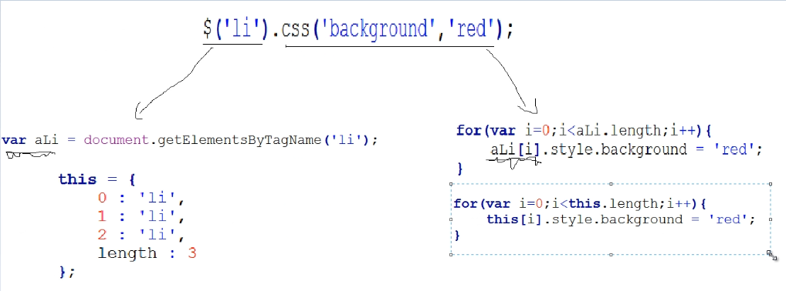

<Excerpt in index | 首页摘要> 
jQuery源码分析
<!-- more -->
<The rest of contents | 余下全文>

-----
### 1
官网：http://jquery.com/
##### 1.1 版本选择
jQuery在2.0版本以后就不在支持IE6/7/8了，我们的版本选2.0.3。之所以选择这个，是因为他不支持IE6/7/8以后会在代码里面减少很多兼容的写法！（未压缩版）

##### 1.2简化jQuery框架
- 21-94 定义了一些变量和函数jQuery=function（）{}；

- 96-283: 给jq对象，添加一些方法和属性

- 285-347:extend:jq的继承方法。如果不明白，找点资料看看js的继承。他就是为了后续添加的方法把它挂在jQuery对象上，便于扩展

- 349-817：jQuery.extend():扩展一些工具方法。什么叫扩展工具的方法？
```javascript
$().css();
$().html();

$.trim();
$.proxy()
```
12和34是由区别的。12在面向对象中是实例的方法，34中$是函数，在函数中扩展方法是一些静态的。所以在函数下面来扩展方法的话，就是来扩展一些静态的方法。所以在jq中来给面向对象扩展静态属性和静态方法的时候，我们就把它叫做扩展工具方法。34与12的区别就是，34既可以给jQuery对象来用，有可以原生的js来用。而34只能给jQuery对象用。

可以吧静态（34）方法看做是在jQuery中最底层的东西，而实例方法（12）是上一层的更高级的东西。所以很多都是实例方法里面调用的工具方法 


- 877-2856：都是完成一个功能---->Sizzle：他的一个作用就是复杂选择器的一个实现，他是一个独立的部分。如果我们平时只是用他的选择功能，可以独立下载这个文件。在jQuery的官网左上角的第四个按钮就是。

比如：
```
$("ul li + span input.userName")
```

- 2880-3042：jQuery中的回调对象，Callbacks通过回调对象，对函数进行统一管理
新增方法，Callback里面还可以写入参数
```html
<!DOCTYPE html>
<html lang="en">
<head>
	<meta charset="UTF-8">
	<script type="text/javascript" src="jquery.js"></script>
	<script type="text/javascript">
		function fn1(){
			alert(1);
		};
		function fn2(){
			alert(2);
		};
		var cb=$.Callbacks();
		cb.add(fn1);
		cb.add(fn2);
		cb.fire();//弹出1，2
	</script>
	<title></title>
</head>
<body>
	
</body>
</html>
```
移除方法：
```html
<!DOCTYPE html>
<html lang="en">
<head>
	<meta charset="UTF-8">
	<script type="text/javascript" src="jquery.js"></script>
	<script type="text/javascript">
		function fn1(){
			alert(1);
		};
		function fn2(){
			alert(2);
		};
		var cb=$.Callbacks();
		cb.add(fn1);
		cb.add(fn2);
		cb.fire();//弹出1，2
		cb.remove(fn2);//移除了fn2方法
		cb.fire();//再次调用，这时候只有只弹出1
	</script>
	<title></title>
</head>
<body>
	
</body>
</html>
```

- 3043-3183:Deferred:实现的延迟对象,对异步的统一管理
在js中有很多的操作都是异步的，比如定时器，比如ajax，

**问题**
```html
<!DOCTYPE html>
<html lang="en">
<head>
	<meta charset="UTF-8">
	<script type="text/javascript">
		setTimeout(function(){
			alert(1);
		},1000)
		alert(2);
		//定时器就是异步的，所以在定时器执行的时候，不会影响后续代码的执行，按照上面的写法，
		//应该先弹出2，在弹出1。但是按照我们的正常思维，应该是按照代码的顺序来执行的，也就
		//是先弹出1，在弹出2，要实现这个效果，只能将alert(2)放在setTimeout()里面。这样方便维护，
		//也看着方便。但是这对于我们来说不方便
		//我们的延迟对象defferred就是来解决这个问题的
	</script>
	<title></title>
</head>
<body>
	
</body>
</html>
```
**使用defferred解决**
```html
<!DOCTYPE html>
<html lang="en">
<head>
	<meta charset="UTF-8">
	<script type="text/javascript" src="jquery.js"></script>
	<script type="text/javascript">
		var dfd =$.Deferred();
		setTimeout(function(){
			alert(1);
			dfd.resolve();
		},1000);
		dfd.done(function(){
			alert(2);
		});
		//这样就会先弹1，再弹出2
	</script>
	<title></title>
</head>
<body>
	
</body>
</html>
```

- 3184-3295:实现support:实现功能检测，对于不同的浏览器进行检测方法是否可用
**比如**3200行，根据他的注释可以看出，check或者radio的值，在老版本和新版本的webkit里面不一样，老版本为空，新版本为on 
```javascript
	// Support: Safari 5.1, iOS 5.1, Android 4.x, Android 2.3
	// Check the default checkbox/radio value ("" on old WebKit; "on" elsewhere)
	support.checkOn = input.value !== "";
``` 

- 3308-3652:实现data()功能，作用就是数据缓存，就是和数据有关的
**例如**
```html
<script type="text/javascript">
	$("#div1").data("name","李明");
	$("#div1").data("name");//这样就可以获取到数据“李明”
</script>
```

- 3653-3797:实现queue()功能：队列管理，入队；dequeue:出队
**常用到的地方就是时间管理** 
```html
<script type="text/javascript">
	$("#div1").animate({left:100});
	$("#div1").animate({top:100});
	$("#div1").animate({width:300});
	//如果保证他的动画是按照顺序一个个执行的，这里就用到了queue队列管理。他的作用就是把
	//上面三个存到一个队列里面，当一个走完，让他出队dequeue
</script>
```
- 3803-4299:完成像attr,prop,val,addClass方法的封装等：对元素属性的操作

- 4300-5128：on,trigger():这里放的都是事件触发的操作，事件的管理


- 5140-6057：实现的dom操作的方法，比如dom的添加，获取，删除，包装等
- 6058-6620：css()的方法，专门针对样式的操作
- 6621-7854：提交的数据和ajax的操作，实现ajax功能的：ajax(),load(),getJson()等
- 7855-8584：animate()的操作，还有show,fadeIn,fadeOut等
- 8585-8792：offerset():位置和尺寸的一些方法。
- 8804-8821：jQuery支持模块化的一个模式 
- 8826 将接口对外暴露
```javascript
window.jQuery = window.$ = jQuery;
``` 
##### 1.3 匿名函数自执行
```html
<!DOCTYPE html>
<html lang="en">
<head>
	<meta charset="UTF-8">
	<script type="text/javascript">
		(function(){
			//好处就是变量是局部的
			var a=10;
			//函数也是局部的
			function $(){
				alert(a);
			};
		})()
		//alert(a);
		$();
		//结果就是都是报错，报未定义
	</script>
	<title>匿名函数自执行的好处</title>
</head>
<body>
	
</body>
</html>
```
jQuery把所有的代码都放在了自执行函数里面，这样他的变量就是局部的，防止和其他的变量有冲突。在jQuery里面$()和jQuery()是一样的 

##### 1.4 对外提供接口
把对外提供的方法挂在window的下面，像上面的$方法，我们挂在window的下面，就可以调用不在报错
```html
<!DOCTYPE html>
<html lang="en">
<head>
	<meta charset="UTF-8">
	<script type="text/javascript">
		(function(){
			//好处就是变量是局部的
			var a=10;
			//函数也是局部的
			function $(){
				alert(a);
			};
			window.$=$;
		})()
		//alert(a);
		$();
		//此时在调用$方法，会弹出10
	</script>
	<title></title>
</head>
<body>
	
</body>
</html>
```

在当前版本中，21-94行都是定义了一些变量和函数，其中有一个函数最为重要
```javascript
jQuery=function(){};
```
这个就是我们平时用的$(),或者jQuery().jQuery中对外提供接口的位置在8860行
```javascript
window.$=window.jQuery=jQuery；
```

##### 1.5 jQuery是一个基于面向对象的
前面是一个对象，（这个里面的执行结果是对象，也可以）才能够调用后面的方法，比如jQuery中

```
$("#div1").css();
$("#div2").html();
```
这些方法的前面都是一个对象，再来看原生的
```
var arr=new Array();
arr.push();
arr.pop();
```
arr之所以后面可以跟一个方法，就是因为arr是一个数组的实例（对象）。jQuery代码里面的第63行：

```
return new jQuery.fn.init( selector, context, rootjQuery );
```

### 21-91 
#### 14
为什么出入参数window？
- 根据作用域链的原理，他的查找速度会变快

```html
(functioin(window){
	window
})(window)
```
- 压缩版本中，传入的是e,也就是方便压缩，减小代码量

```html
(functioin(e){
	e
})(e)
```
参数undefined
- 他是js的一个属性，可以在外部进行修改
- 兼容性，在Firefox，Chrome，IE9/10/11里面不管你定不定义，弹出来的都是undefined
```html
		var undefined=10;
		alert(undefined);
		//在Chrome、Firefox，IE9/10/11都是弹出的结果都是undefined
		//IE8/7弹出10
```
- 为了防止其他人在外面对undefined进行修改，所以他进行了一个传参的操作，防止被修改


#### 20 use strict使用严格模式
```
	"use strict";
	//不加var 关键字会报错
	a=10;
```
注释掉以后完全可以没问题

在例如
```html
	//再例如八进制数
	var a=010;
	//不允许使用八进制
```

#### 23 rootjQuery
- 他是我们的根节点，可以在866行找到他的赋值语句，这个变量在压缩版的时候可以直接变成一个字符。
- 方便维护，一目了然，就想下面这个一样

```
var isSpeed=10;
var a=a+isSpeed;

对比
var a=a+10;
```

#### 26 readyList
与dom加载有关的变量，在349-2856之间。到时候再说


#### 30 core_strundefined
存的是一个字符串形式的undefined

- 判断window下面的变量（属性）是否是不存在的
```
 window.a==undefined;
//返回true
```

- 或者
```
typeof window.a=="undefined";
//返回true
```

- 在很少的一些情况下，光是这么去判断可能判断不出来，这个东西在IE6/7/8/9有问题，加入我们判断一个xml一个节点或者属性的时候，这种时候，只用，window.a==undefined这种形式可能判断不出来他会认为条件不充分，所以为了做到所有情况的兼容，最好使用下面这种写法，出现这种情况的时候非常少


#### 33-35 对于一些window下的变量进行存储

#### 37-41 防止变量冲突
等到讲到防止冲突的时候在详细的讲
$可能在其他的库中也用到，所以，
```html
var $=10;
//这时候就会有冲突，jQuery会自动解决
```
上面代码中的$会赋值给41行的_$,如果没有冲突的话，两个变量存的值是undefined

这个在扩展一些工具方法里面用到了（349-817）

#### 44 定义了一个空的对象字面量

$.type首先用到的，用来判断每一个变量或者每一个元素的类型，	class2type = {},
里面会存成一个
```
class2type={"[Object/String]":"string","[Object Array]":"array"}
```
用来做类型判断的，两个类型的字符串格式，在$.type()的时候会用到

#### 47 core_deletedIds
定义一个和缓存数据有关的数组，在老版本中，和3308-3652里面的data()函数有关，在2.0.3版本中已经没有什么用处了

#### 49 core_version
存储的版本号

#### 52-58
把一些js中常用的字符串，数组函数等的方法进行局部存储，可以很方便的在后面使用，对压缩也有很大的帮助

#### 58 core_trim
去掉字符串的前后空格，老版本没有，需要自己写一个正则
eg:
```
//window.alert("("+ "   adfaf   "  +")");
//在字符串后面直接调用trim()方法，没有空格
window.alert("("+ "   adfaf   ".trim()  +")");
```

#### 61 jQuery
```html
jQuery = function( selector, context ) {
	return new jQuery.fn.init( selector, context, rootjQuery );
},
```
- 定义jQuery方法，可以看8843行，在jQuery中$()和jQuery()这两个是一样的，他俩最终调用的都是下面这个jQuery

- 这个函数里面返回的是一个对象，这样他的后面才可以接他拥有的方法，jQuery.fn.init是他的真正的构造函数,查看96行，jQuery.fn = jQuery.prototype，说明fn就是原型,就是prototype

- 看源码中的283行jQuery.fn.init.prototype = jQuery.fn，这里的fn就等于prototype	

- 普通的面向对象的写法
```html
<script>
    //先写构造函数
    function Aaa(){

    };
    //然后在构造函数下面加载原型
    //一般都是先给他一个初始化的方法
    Aaa.prototype.init=function(){

    };
    //然后在原型下面在加载其他的方法
    Aaa.prototype.css=function(){

    };
    //然后只要在下面new一个构造函数就可以新建一个对象出来
    var a1=new Aaa();
    //创建好对象以后，有初始化方法的就需要先进行初始化
    a1.init();

    //然后就可以通过a1这个对象来调用我们构造函数里面的方法了
    a1.css();
</script>
```
- jQuery的面向对象的写法
```html
<script>
    //先写一个构造函数
    //看源码中的283行jQuery.fn.init.prototype = jQuery.fn，这里的fn就等于prototype	
    function jQuery(){
        return new jQuery.prototype.init();
    };
    jQuery.prototype.init=function(){

    };
    jQuery.prototype.css=function(){

    };
    //加上这句话就可以使我们的对象能够拿到css这个方法了
    //init这个函数的原型等于jQuery的原型，这样就形成了一个对象的引用，把一个对象赋值给另外一个对象，这样就形成了
    //对象的引用关系，这样我们在后面这个构造函数原型上进行修改和在前面这个函数原型上面进行修改是一样的。
    //所以说我们的jQuery在jQuery这个构造函数下面写的任何的方法，同样可以通过jQuery.prototype.init这个构造
    //函数new出来的对象来使用来引用
    jQuery.prototype.init.prototype=jQuery.prototype;   
    //这里直接调用就可以
    jQuery().css();
</script>
```

- 61行，jQuery中的
```
return new jQuery.fn.init
```
结合96行，
```
jQuery.fn = jQuery.prototype
```
所以61行变为
```
jQuery.prototype.init
```
在结合283行
```
jQuery.fn.init.prototype = jQuery.fn
```
283变为
```
jQuery.prototype.init.prototype=jQuery.prototype
```
所以61行的，返回一个构建jQuery.prototype.init对象，就是返回jQuery对象！

#### 67 core_pnum
正则的作用就是去找匹配数字的，包括正数，负数，小数点，还有科学计数法，这个正则会在后面的css方法里面使用

#### 70 core_rnotwhite
匹配单词有关的，\s就是空格，调用这个正则就可以找到一个整体的单词，因为单词和单词之间是由空格分开的

#### 75 rquickExpr
匹配的是一个标签或者id.防止通过 location.hash进行xss注入，location.hash就是页面中的锚点，用来做快速定位
比如www.520wsr.com/#message,快速定位到页面中message这个锚点的位置，有的人可能就利用这个漏洞来注入xss,
他可能在后面直接写入一段代码，例如www.520wsr.com/#<div>....</div>,之前的jQuery看到这个会帮你去创建一个div
如果这个div里面有木马程序的话就会很危险。
下面这个正则就是为了防止上面说的情况，他会识别真正的id，而不是一些带有<>标签的，所以可以防止注入
匹配：<p>aaaa或者#div1这两种形式

#### 78 rsingleTag
匹配的是一个成对的空标签，比如<p></p>,<div></div>

#### 81 rmsPrefix
ms是IE的一个前缀，除了这个还有webkit,在css中写一个margin-lift,如果写入js中，是不能出现横杠的，可以写为maginLift。rmsPrefix和82rdashAlpha都是用来处理css3的带有-的元素的
```
//一般情况下的对应关系
margin-left:marginLeft
//webkit下对应关系
-webkit-margin-left:css3会转为webkitMarginLeft

//但是有一个就是比较特殊，那就是IE下面的ms,IE下面去转的话是这样,第一个m是大写
-ms-margin-left:MsMarginLeft
```

#### 82 rdashAlpha
找到横杆-和字符a-z，和上面的81行那个一起用，进行css3的转换
-2d也会转为2d

#### 85 fcamelCase 
转驼峰的回调函数

#### 90 completed
dom加载成功的时候触发的，后面讲到再说

### 96-283
给jQuery对象，添加一些常用的属性和方法
```
jQuery.fn=jquery.prototype={
    jquery:版本,
    constructor:修正指向问题,
    init():初始化和参数管理,
    selector:存储选择字符串,
    length:this对象的长度,
    toArray():转数组,
    get():改原生集合，
    pushStact():JQ对象入栈，
    each():遍历集合，
    ready():DOM加载的接口，
    slice():集合的截取，
    first():集合的第一项,
    last():集合的最后一项,
    eq():集合的指定项目,
    map():返回新集合,
    end():返回集合前一个状态,
    push():内部使用,
    sort():内部使用,
    slice():内部使用
};
```
上面，属性都没有加括号，方法都加了括号

#### 98 jquery
版本就是指向我们上面的那个变量（#49） 
```
alert($().jquery);
//2.0.3
```

#### 100 constructor
constructor在面向对象的中就是创建出来的对象下面所拥有的一个属性，这个属性指向的就是这个对象所属的构造函数是谁

eg:
```
function Aaa(){};
var a1=new Aaa();
alert(a1.constructor);
//function Aaa(){}
```
a1.constructor指向的是他的构造函数Aaa。在js源码中会自动生成一个
```
Aaa.prototype.constructor=Aaa;
```
所以在我们调用的时候是可以找到他的。那么是自动生成的，那么为什么jQuery中还要手动的指向一下呢？那是因为他的写法中，把指向给改了。

```
function Aaa(){};
var a1=new Aaa();
//如果强制更改他的constructor指向
Aaa.prototype.constructor=Array;
alert(a1.constructor);
//加了强制指向：function Array() { [native code] }
```
这说明constructor属性很容易被修改掉，所以有些特殊情况我们需要修复一下，比如：
```
Aaa.prototype.name="jarry";
Aaa.prototype.age=20;
//因为Aaa.prototype本身就是一个对象，所以我们也可以用对象的写法，如下
Aaa.prototype={
    "name":"jarry",
    "age":12
};
//在大部分情况下，上面的两种写法都是没有区别的，但是在面向对象的过程中是有区别的
```
prototype两种不同的挂载方法的区别
- 第一种,直接等号挂载，实例的返回的constructor就是Aaa
```
function Aaa(){};

Aaa.prototype.name="jarry";
Aaa.prototype.age=20;

var a1=new Aaa();
alert(a1.constructor);
//function Aaa(){}
```

- 第二种：使用prototype对象挂载，实例返回的constructor是Objcet!
```
function Aaa(){};
Aaa.prototype={
    "name":"jarry",
    "age":12
};
var a1=new Aaa();
alert(a1.constructor);
//function Object() { [native code] }
```

#### 为什么会出现这种问题？
第一种写法，name和age都是往原型上进行添加处理，所以他默认的`Aaa.prototype.constructor=Aaa`，不会有任何的影响。

第二种不是添加，而是他是一个json进行覆盖操作，这个json对象直接把原来的prototype给覆盖了。所以现在的constructor指向的肯定是那个给定的json所对应的构造函数。

基于上面的不同情况，所以我们在平时使用的时候还需要把他的指向给修正过来，否则使用的时候肯定出问题

#### 修正一下
```
function Aaa(){};
Aaa.prototype={
    constructor:Aaa,
    "name":"jarry",
    "age":12
};
var a1=new Aaa();
alert(a1.constructor);
//function Aaa(){}
```

基于以上的原因，jQuery源码中prototype方法挂载也是用的第二种，所以就有了第100行的代码写法

#### 101 init()
初始化和参数的一个管理
对外提供接口就是$()或者jQuery()，其实他俩是同一个函数，$就是jQuery的简写方式，最终调用的都是（#61）那个函数，但是（#61），那里真正的构造函数是init，#61如下：
```
jQuery = function( selector, context ) {
	// The jQuery object is actually just the init constructor 'enhanced'
	return new jQuery.fn.init( selector, context, rootjQuery );
}
```
可以看到对外接口传进来的参数就是一个元素一个作用域，最后都跑到了init里面了，

#### init里面的参数selector
`$("li")`获取的是页面中所有的li，而`$("li","ul")`是获取的ul下面的li，第二个元素就是前面第一个元素的限制条件。

#### 在jQuery中可以接受的参数有哪些类型？
init可以对这写类型进行一些简单的分配，然后在分别进行处理

#### 104 先对一些不正确的进行处理
 $(""), $(null), $(undefined), $(false)
上面举的例子都是走的init里面的字符串
#### 105 
当你写错，让他直接返回，不让他往下继续执行了，这里的this就是对象，这样他也不会报错
#### 110 去判断字符串
比如$("#div1"),$(".box"),$("div")或者是一些更复杂的选择，比如$("#main div.div1")

```
$(function(){
    //$("li").css("background","#f00");
    //将上面代码分解一下用原生去写
    var aLi=document.getElementsByTagName("li");
    for(var i=0;i<aLi.length;i++){
        aLi[i].style.background="red";
    };
    //jQuery中
    this={
        0:"li",
        1:"li",
        2:"li",
        length:3,
    };
    for(var i=0;i<this.length;this++){
        this[i].style.background="red";
    };
})
```

还有：`$("<li>")`:创建一个标签，所以说字符串除了被选以外还可以被创建，还可以创建更复杂的，比如`$("<li>1</li><li>a</li>)`

#### 查看一下对象
```
$(function(){
    //用Firefox打开这个页面，就可以看到效果
    console.log($("li").css("background","#f00"));
})
```

#### $()获取到的就是原生对象
```
$(function(){
    
    $("li")[1].style.background="red";
})
```
在我们前面说过，在96-283简化版本中有一个length:this对象的长度,

#### 对字符串做处理
```
$("#div1"),$(".box"),$("div") $("#div1 div.box")
$("li")  $("<li>1</li><li>2</li>")
```
#### 111 
首先判断一下，最左边的字符是不是<，然后又判断了一下最右边的字符是不是>,并且长度>=3，其实就是去找标签
```
//li会被添加进入ul,但是hello不会,相当于$("<li>").appendTo($("ul"));
//$("<li>hello").appendTo($("ul"));
//这样写li和hello都会添加进入ul
$("<li>hello</li>").appendTo($("ul"));
```

#### 113 match定义了两个变量
```
        if(){
             //$("li")  $("<li>1</li><li>2</li>")
        }else{
             //$("#div1"),$(".box"),$("div") $("#div1 div.box")
             //注意下面这种情况
             //$("<li>hello")
        }
```
- 如果是单标签，就是if里面的第一种情况
match=[null,"<li>",null];

- 如果是多标签，就是if里面的第二种
match=[null,<li>1</li><li>2</li>,null]

#### 116 else的情况
匹配正则 rquickExpr （#75），其实就是标签有没有加文字，就是113里面的，`$("<li>hello")`，这种情况
- (<[\w\W]+>):匹配标签
- [^>]：后面是文字
匹配正则 rquickExpr （#75），或者是id的情况，`$("#div1")`
- #([\w-]*) 或上ID的形式

#### 上面两种匹配到的
根据#116的写法`match = rquickExpr.exec( selector );`
- $("#div1"):`match=["#div1",null,"div1"];`

- $("<li>hello"):`match=["<li>hello","<li>",null];`

- 但是依照我们113写的，还有一种情况没有匹配到，如下:
```
$("div") $("#div1 div.box")
```
所以他返回的就是null


#### 120 
`if ( match && (match[1] || !context) ) {`
能走上面的那个if的
```
 //$("li")  $("<li>1</li><li>2</li>")
//$("#div1")
```
也就是能进这个if的都是创建标签或者id的形式

!context:的意思是没有上下文

#### 123-150 再次进行判断进入if
进入if的是选择标签的时候`$("<li>")`

#### 150-164再次进行判断进入else
进入else的时候是选择id的时候`$("#div1")`
#### 200 默认length的长度是0
#### 177 对dom元素直接进行处理
比如`$(this)`,或者`$(document)`

#### 184 处理传函数的情况
比如`$(function(){})`

#### 193 处理传数组或者json的情况
例如`$([])`或者`$({})`

9