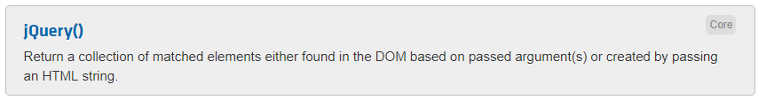
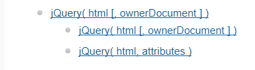
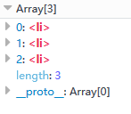
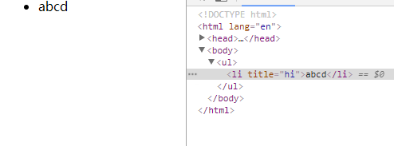

<Excerpt in index | 首页摘要> 
jQuery源码分析---96至283
<!-- more -->
<The rest of contents | 余下全文>

-----

### 96-283
给jQuery对象，添加一些常用的属性和方法
```
jQuery.fn=jquery.prototype={
    jquery:版本,
    constructor:修正指向问题,
    init():初始化和参数管理,
                110-177 处理字符串，包含下面情况：
                    $("#div1"),$(".box"),$("div") $("#div1 div.box")
                    $("li")  $("<li>1</li><li>2</li>")

                    120-167 if 语句，创建标签和id的形式
                        123-150:在次进行if,创建标签
                        150-164:上面if对应的else,就是对应的id的形式

                    167-172 else if

                    172-177 else

                
                177-184

                184-186


    selector:存储选择字符串,
    length:this对象的长度,
    toArray():转数组,
    get():改原生集合，
    pushStact():JQ对象入栈，
    each():遍历集合，
    ready():DOM加载的接口，
    slice():集合的截取，
    first():集合的第一项,
    last():集合的最后一项,
    eq():集合的指定项目,
    map():返回新集合,
    end():返回集合前一个状态,
    push():内部使用,
    sort():内部使用,
    slice():内部使用
};
```
上面，属性都没有加括号，方法都加了括号

#### 98 jquery
版本就是指向我们上面的那个变量（#49） 
```javascript
alert($().jquery);
//2.0.3
```

#### 100 constructor
constructor在面向对象的中就是创建出来的对象下面所拥有的一个属性，这个属性指向的就是这个对象所属的构造函数是谁

eg:
```javascript
function Aaa(){};
var a1=new Aaa();
alert(a1.constructor);
//function Aaa(){}
```
a1.constructor指向的是他的构造函数Aaa。在js源码中会自动生成一个
```javascript
Aaa.prototype.constructor=Aaa;
```
所以在我们调用的时候是可以找到他的。那么是自动生成的，那么为什么jQuery中还要手动的指向一下呢？那是因为他的写法中，把指向给改了。

```javascript
function Aaa(){};
var a1=new Aaa();
//如果强制更改他的constructor指向
Aaa.prototype.constructor=Array;
alert(a1.constructor);
//加了强制指向：function Array() { [native code] }
```
这说明constructor属性很容易被修改掉，所以有些特殊情况我们需要修复一下，比如：
```javascript
Aaa.prototype.name="jarry";
Aaa.prototype.age=20;
//因为Aaa.prototype本身就是一个对象，所以我们也可以用对象的写法，如下
Aaa.prototype={
    "name":"jarry",
    "age":12
};
//在大部分情况下，上面的两种写法都是没有区别的，但是在面向对象的过程中是有区别的
```
prototype两种不同的挂载方法的区别
- 第一种,直接等号挂载，实例的返回的constructor就是Aaa
```javascript
function Aaa(){};

Aaa.prototype.name="jarry";
Aaa.prototype.age=20;

var a1=new Aaa();
alert(a1.constructor);
//function Aaa(){}
```

- 第二种：使用prototype对象挂载，实例返回的constructor是Objcet!
```javascript
function Aaa(){};
Aaa.prototype={
    "name":"jarry",
    "age":12
};
var a1=new Aaa();
alert(a1.constructor);
//function Object() { [native code] }
```

#### 为什么会出现这种问题？
第一种写法，name和age都是往原型上进行添加处理，所以他默认的`Aaa.prototype.constructor=Aaa`，不会有任何的影响。

第二种不是添加，而是他是一个json进行覆盖操作，这个json对象直接把原来的prototype给覆盖了。所以现在的constructor指向的肯定是那个给定的json所对应的构造函数。

基于上面的不同情况，所以我们在平时使用的时候还需要把他的指向给修正过来，否则使用的时候肯定出问题

#### 修正一下
```javascript
function Aaa(){};
Aaa.prototype={
    constructor:Aaa,
    "name":"jarry",
    "age":12
};
var a1=new Aaa();
alert(a1.constructor);
//function Aaa(){}
```

基于以上的原因，jQuery源码中prototype方法挂载也是用的第二种，所以就有了第100行的代码写法


#### 101 init()
初始化和参数的一个管理
对外提供接口就是$()或者jQuery()，其实他俩是同一个函数，$就是jQuery的简写方式，最终调用的都是（#61）那个函数，但是（#61），那里真正的构造函数是init，#61如下：
```javascript
jQuery = function( selector, context ) {
	// The jQuery object is actually just the init constructor 'enhanced'
	return new jQuery.fn.init( selector, context, rootjQuery );
}
```
可以看到对外接口传进来的参数就是一个元素一个作用域，最后都跑到了init里面了，

**这里面初始化的时候selector有如下情况**
```javascript
$()  jQuery()
$('li','ul')

$('')  $(null) $(undefined)  $(false)
$("<li>")  $("<li>2</li><li>3</li>)
$("#div1")  $(".box")  $("div")  $("#div1 div.box")


$(this) $(document)

$(function(){})

$([]) $({})
```

#### init里面的参数selector
`$("li")`获取的是页面中所有的li，而`$("li","ul")`是获取的ul下面的li，第二个元素就是前面第一个元素的限制条件。

#### 在jQuery中可以接受的参数有哪些类型？
init可以对这写类型进行一些简单的分配，然后在分别进行处理

#### 104 先对一些不正确的进行处理
 $(""), $(null), $(undefined), $(false)
上面举的例子都是走的init里面的字符串
#### 105 
当你写错，让他直接返回，不让他往下继续执行了，这里的this就是对象，这样他也不会报错
#### 110 去判断字符串
比如$("#div1"),$(".box"),$("div")或者是一些更复杂的选择，比如$("#main div.div1")

```javascript
$(function(){
    //$("li").css("background","#f00");
    //将上面代码分解一下用原生去写
    var aLi=document.getElementsByTagName("li");
    for(var i=0;i<aLi.length;i++){
        aLi[i].style.background="red";
    };
    //jQuery中
    this={
        0:"li",
        1:"li",
        2:"li",
        length:3,
    };
    for(var i=0;i<this.length;this++){
        this[i].style.background="red";
    };
})
```

还有：`$("<li>")`:创建一个标签，所以说字符串除了被选以外还可以被创建，还可以创建更复杂的，比如`$("<li>1</li><li>a</li>)`

#### 查看一下对象
```javascript
$(function(){
    //用Firefox打开这个页面，就可以看到效果
    console.log($("li").css("background","#f00"));
})
```

#### $()获取到的就是原生对象
```javascript
$(function(){
    
    $("li")[1].style.background="red";
})
```
在我们前面说过，在96-283简化版本中有一个length:this对象的长度,

#### 对字符串做处理
```javascript
$("#div1"),$(".box"),$("div") $("#div1 div.box")
$("li")  $("<li>1</li><li>2</li>")
```
#### 111 
首先判断一下，最左边的字符是不是<，然后又判断了一下最右边的字符是不是>,并且长度>=3，其实就是去找标签
```
//li会被添加进入ul,但是hello不会,相当于$("<li>").appendTo($("ul"));
//$("<li>hello").appendTo($("ul"));
//这样写li和hello都会添加进入ul
$("<li>hello</li>").appendTo($("ul"));
```

#### 113 match定义了两个变量
```javascript
        if(){
             //$("li")  $("<li>1</li><li>2</li>")
        }else{
             //$("#div1"),$(".box"),$("div") $("#div1 div.box")
             //注意下面这种情况
             //$("<li>hello")
        }
```
- 如果是单标签，就是if里面的第一种情况
match=[null,"<li>",null];

- 如果是多标签，就是if里面的第二种
match=[null,<li>1</li><li>2</li>,null]

#### 116 else的情况
匹配正则 rquickExpr （#75），其实就是标签有没有加文字，就是113里面的，`$("<li>hello")`，这种情况
- (<[\w\W]+>):匹配标签
- [^>]：后面是文字
匹配正则 rquickExpr （#75），或者是id的情况，`$("#div1")`
- #([\w-]*) 或上ID的形式

#### 上面两种匹配到的
根据#116的写法`match = rquickExpr.exec( selector );`
- $("#div1"):`match=["#div1",null,"div1"];`

- $("<li>hello"):`match=["<li>hello","<li>",null];`

- 但是依照我们113写的，还有一种情况没有匹配到，如下:
```
$("div") $("#div1 div.box")
```
所以他返回的就是null


#### 120 
`if ( match && (match[1] || !context) ) {`
能走上面的那个if的
```javascript
 //$("li")  $("<li>1</li><li>2</li>")
//$("#div1")
```
也就是能进这个if的都是创建标签或者id的形式

!context:的意思是没有上下文

#### 123-150 再次进行判断进入if
进入if的是选择标签的时候`$("<li>")`

#### 124
看一下执行的上下文，instanceof jQuery是否为真。创建一个标签为什么会有执行上下文？
eg:
平时创建标签`$("<li>")`,对应到原生就是`document.createElement("li")`.那么`$("<li>",第二个参数)`里面的第二个参数只能是document，即`$("<li>",document)`,所以说第二个参数的作用就是在指定的不同的环境下找到根节点。如果不写document，比如`$("<li>")`，他就是在当前页面创建li标签；也可以写上document，即`$("<li>",document)`,他的意思还是在当前页面创建li标签。但是你也可以写成别的，比如iframe的形式`$("<li>",contentWindow.document)`。这样就可以找到iframe当中的document，这样写的时候，li是在对应的iframe里面创建的。jQuery中确实是这么做的，但是用处不大。

打开jQuery官网，打开[API Documentation页面](http://api.jquery.com/),在search里面搜索jQuery(),找到如下如所示的区域，点击展开

http://api.jquery.com/jQuery/

如上图所示就能找到我们的

这里为什么要判断一下instance of jjQuery?
```javascript
context = context instanceof jQuery ? context[0] : context;
```

原因在于
```javascript
$("<li>",documentWindow.document)
```
第二个参数可能直接写成原生的
```javascript
$("<li>",document)
```
如果写成原生的，`document instance of jQuery`肯定是假的,然后直接就返回了context，这里是原始的document。但是有时候可能这么写
```javascript
$("<li>",$(document))
```
这时候` context instanceof jQuery `返回的就是真了,即`context=context[0]`,这时候的context本身就是`$(document)`,但是我们要的是原生的，所以在里面选择一个属性是0的那个原生的document。反正最后得到的都是原生的。
**补充知识：**  [contentWindow.document](https://www.baidu.com/baidu?tn=null&ie=utf-8&wd=contentWindow.document)


#### 127-131
```javascript
$("<li>1</li><li>2</li>").appendTo('ul')
```
通过
```html
$("<li>1</li><li>2</li>")
```
我们想得到
```javascript
this={
    0:'li',  
    1:'li',
    length:2
}
```

所以不管是单标签`$("<li>")`还是多标签`$("<li>1</li><li>2</li>")`最后都是走的是127那一行的parseHTML.**你要对jQuery.parseHTML这个方法有一定的了解**

#### 127
jQuery.parseHTML这个方法就是把一个字符串转成节点数组，

#### 128 只有一个参数的时候
举个例子
```html
<!DOCTYPE html>
<html lang="en">
<head>
    <meta charset="UTF-8">
    <script src="../jquery.js"></script>
    <script>
        $(function(){
            var str='<li>1</li><li>2</li><li>3</li>';
            var arr=jQuery.parseHTML(str);
            console.log(arr);
            $.each(arr,function(i){
                $('ul').append(arr[i]);
            })
        })
    </script>
    <title>Document</title>
</head>
<body>
    <ul></ul>
</body>
</html>
```
结果如图所示


#### 129. jQuery.parseHTML还有第二个参数,

就是指定根节点，可以是当前的页面也可以是iframe的页面
```javascript
jQuery.parseHTML(str,document)
```

#### 130. jQuery.parseHTML还有第三个参数
那么true和false有什么关系呢？
在默认情况下，是false
```javascript
var str='<li>1</li><li>2</li><li>3</li><script>alert("1")</script>';
```
**注意：**在字符串中，其他的标签的闭合标签都可以写`/`,但是唯独`</script>`标签的反斜杠不能直接写,需要转义一下`<\/script>  `

这第三个参数就是允不允许`<script>`标签添加，默认情况下（false）是添加不进去的，如果你把第三个参数改为true，这时候就可以弹出1的,如下代码
```html
<!DOCTYPE html>
<html lang="en">
<head>
    <meta charset="UTF-8">
    <script src="../jquery.js"></script>
    <script>
        $(function(){
            var str='<li>1</li><li>2</li><li>3</li><script>alert("哈哈哈")<\/script>';
            var arr=jQuery.parseHTML(str,document,true);
            console.log(arr);
            $.each(arr,function(i){
                $('ul').append(arr[i]);
            })
        })
    </script>
    <title>Document</title>
</head>
<body>
    <ul></ul>
</body>
</html>
```


jQuery.parseHTML操作最终返回的是一个数组,但是我们最后要的是一个json而不是数组，这时候就用到啦**127行**jQuery.merge,两个数组合并到一个数组中
```javascript
    $(function(){
        var arr1=["s","b","c"],
            arr2=["d","c","m"];
        var arr=$.merge(arr1,arr2);
        console.log(arr);
        //Array [ "s", "b", "c", "d", "c", "m" ]
    })
```

$.merge对外就是对数组进行合并，但是对内，他还可以合并json,但是有特定条件,如下代码
```html
<!DOCTYPE html>
<html lang="en">
<head>
    <meta charset="UTF-8">
    <script src="../jquery.js"></script>
    <script>
        $(function(){
            var arr1={
                0:'a',
                1:'b',
                length:2
            },
                arr2=["d","c","m"];
            var arr=$.merge(arr1,arr2);
            console.log(arr);
            //firefox中:Object [ "a", "b", "d", "c", "m" ]
            //chrome:Object {0: "a", 1: "b", 2: "d", 3: "c", 4: "m", length: 5}
        })
    </script>
    <title>Document</title>
</head>
<body>
    <ul></ul>
</body>
</html>
```

综上所述127-131得到的就是如下的结果
```javascript
this={
    0:'li',  
    1:'li',
    length:2
}
```
#### 134-145
这一部分处理的是如下的形式
```html
<!DOCTYPE html>
<html lang="en">
<head>
    <meta charset="UTF-8">
    <script src="../jquery.js"></script>
    <script>
        $(function(){
            $("<li>",{title:"hi",html:"abcd"}).appendTo('ul');
        })
    </script>
    <title>Document</title>
</head>
<body>
    <ul></ul>
</body>
</html>
```


#### 134
首先进行了一个正则的判断` rsingleTag.test`,` rsingleTag`这个正则的意思是匹配单标签，单标签的意思就是他只能匹配成功`$('<li>')`,或者是这种`$('<li></li>')`,除了这两种以外，剩下的都不行，比如说两个的时候。`$('<li></li><li></li>')`，可以试一下
```javascript
        $(function(){
            $("<li></li><li></li>",{title:"hi",html:"abcd"}).appendTo('ul');
        })
```

可以看到li标签是创建成功了，但是{}里面的东西没有创建成功

#### 134 第二部分是要求必须是一个对象字面量
```javascript
jQuery.isPlainObject( context )
``` 
我们可以看到上面那个例子，第二个参数确实是一个字面量形式的参数
```javascript
{title:"hi",html:"abcd"}
```

#### 135
进入if以后，进行了一个for...in...循环，然后里面又是一个if...else..

#### 137
```javascript
if ( jQuery.isFunction( this[ match ] ) )
```
`isFunction`判断他是不是函数,此时的this是`{title:"hi",html:"abcd"}`,match就是title或者html.咱们的jQuery里面有`html()`这个方法，但是没有title的方法，所以此时html进入if里面，然后进行函数调用处理`this[ match ]( context[ match ] );`,所以你在里面写`html:"abcd"`,相当于`this.html("abcd")`


#### 141 
else就是给他加属性，就像上面的`title:"hi"`

#### 142
加属性，如上

#### 147 创建标签完成
字符串里面只说了标签
```javascript
$("<li>")  $("<li>2</li><li>3</li>)
```
但是还有好多没有处理的，如
```javascript
$()  jQuery()
$('li','ul')

$('')  $(null) $(undefined)  $(false)

$("#div1")  $(".box")  $("div")  $("#div1 div.box")


$(this) $(document)

$(function(){})

$([]) $({})
```

#### 150-164再次进行判断进入else
进入else的时候是选择id的时候`$("#div1")`

#### 151
通过原生的getElementById来获取id元素，这里的match[2],就是`match=["#div1",null,"div1"];`里面的角标为2的，正好就是div1

#### 153-154
一般的情况下，所有的浏览器去判断元素存不存在就知道我们的获取的id对不对，但是有一种特殊的情况，就是在黑莓46的系统下，光判断elem是不靠谱的，可能这个元素
不在页面上，但是if(elem)还是能找到，所以又加了一个如果这个elem存在，并且他有父级，那他一定是存在的；相反的如果一个元素不存在，他肯定是没有父级的


#### 157-158
前面说过，jQuery选择元素的时候，是存成了一个json的形式，并不是一个数组，这样的话是没有长度的，所以说必须手动的给他加一个length，并且里面的第一项存的
就是我们的elem

#### 161
这是的上下文就是document

#### 162
这时候的select就是我们容器选择到的字符串，比如`#div1`


#### 163
返回这个对象，不需要在往后去查找了


#### 167
判断`$(expr, $(...))`,当这个执行上下文不存在的时候`!context`,下面的context就是不存在，或一下`rootjQuery`,所以`( context || rootjQuery )`
里面的值就是rootjQuery,rootjQuery就是`$(document)`,find就是在指定的节点下面进行筛选，比如

```javascript
$(document).find('ul li.box')
```
在复杂的一些选择其实都是通过find来实现的，find最后调用的就是sizzle


当context存在上线文的时候，他就会接着走`context.jquery`,这时候就是看一下上下文是不是jQuery对象，如果是jQuery对象，就接着往后走，如果不是就到了172行


上面有点绕，详细一些

```
$('ul',document).find('li'); document是原生的，这是的167行`context.jquery`，上下文是找不到jQuery属性的，因为属性是在jQuery对象下面的，这时候就会走172的else，这个else里面的`this.constructor`就是jQuery，context就是document，综上，这段代码就相当于

```
jQuery(document).find();
```

//或者

$('ul',$(document)).find('li'); 这句话的document是jQuery选择器下面的，167行的`context.jquery`就会为真，就会走168的rootjQuery，我们上面说了，rootjQuery就是`$(document)`，综上，这段代码相当于
···
jQuery(document).find();
```

$('ul').find('li')在167没有上下文的时候，就是`!context`,由于context不存在，所以168的时候就是走的rootjQuery


说白了就是find要求他前面必须是一个jQuery对象
#### 172
```
$('ul',document).find('li'); document是原生的，这是的167行`context.jquery`，上下文是找不到jQuery属性的，因为属性是在jQuery对象下面的，这时候就会走172的else，这个else里面的`this.constructor`就是jQuery，context就是document，综上，这段代码就相当于

```
jQuery(document).find();
```


#### 200 默认length的长度是0
#### 177 对dom元素直接进行处理
比如`$(this)`,或者`$(document)`

#### 184 处理传函数的情况
比如`$(function(){})`

#### 193 处理传数组或者json的情况
例如`$([])`或者`$({})`

11