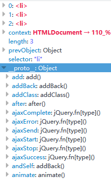

<Excerpt in index | 首页摘要> 
jQuery源码分析---96至283
<!-- more -->
<The rest of contents | 余下全文>

-----

### 96-283
给jQuery对象，添加一些常用的属性和方法
```
jQuery.fn=jquery.prototype={
    jquery:版本,
    constructor:修正指向问题,
    init():初始化和参数管理,
    selector:存储选择字符串,
    length:this对象的长度,
    toArray():转数组,
    get():改原生集合，
    pushStact():JQ对象入栈，
    each():遍历集合，
    ready():DOM加载的接口，
    slice():集合的截取，
    first():集合的第一项,
    last():集合的最后一项,
    eq():集合的指定项目,
    map():返回新集合,
    end():返回集合前一个状态,
    push():内部使用,
    sort():内部使用,
    slice():内部使用
};
```
上面，属性都没有加括号，方法都加了括号

#### 98 jquery
版本就是指向我们上面的那个变量（#49） 
```
alert($().jquery);
//2.0.3
```

#### 100 constructor
constructor在面向对象的中就是创建出来的对象下面所拥有的一个属性，这个属性指向的就是这个对象所属的构造函数是谁

eg:
```
function Aaa(){};
var a1=new Aaa();
alert(a1.constructor);
//function Aaa(){}
```
a1.constructor指向的是他的构造函数Aaa。在js源码中会自动生成一个
```
Aaa.prototype.constructor=Aaa;
```
所以在我们调用的时候是可以找到他的。那么是自动生成的，那么为什么jQuery中还要手动的指向一下呢？那是因为他的写法中，把指向给改了。

```
function Aaa(){};
var a1=new Aaa();
//如果强制更改他的constructor指向
Aaa.prototype.constructor=Array;
alert(a1.constructor);
//加了强制指向：function Array() { [native code] }
```
这说明constructor属性很容易被修改掉，所以有些特殊情况我们需要修复一下，比如：
```
Aaa.prototype.name="jarry";
Aaa.prototype.age=20;
//因为Aaa.prototype本身就是一个对象，所以我们也可以用对象的写法，如下
Aaa.prototype={
    "name":"jarry",
    "age":12
};
//在大部分情况下，上面的两种写法都是没有区别的，但是在面向对象的过程中是有区别的
```
prototype两种不同的挂载方法的区别
- 第一种,直接等号挂载，实例的返回的constructor就是Aaa
```
function Aaa(){};

Aaa.prototype.name="jarry";
Aaa.prototype.age=20;

var a1=new Aaa();
alert(a1.constructor);
//function Aaa(){}
```

- 第二种：使用prototype对象挂载，实例返回的constructor是Objcet!
```
function Aaa(){};
Aaa.prototype={
    "name":"jarry",
    "age":12
};
var a1=new Aaa();
alert(a1.constructor);
//function Object() { [native code] }
```

#### 为什么会出现这种问题？
第一种写法，name和age都是往原型上进行添加处理，所以他默认的`Aaa.prototype.constructor=Aaa`，不会有任何的影响。

第二种不是添加，而是他是一个json进行覆盖操作，这个json对象直接把原来的prototype给覆盖了。所以现在的constructor指向的肯定是那个给定的json所对应的构造函数。

基于上面的不同情况，所以我们在平时使用的时候还需要把他的指向给修正过来，否则使用的时候肯定出问题

#### 修正一下
```
function Aaa(){};
Aaa.prototype={
    constructor:Aaa,
    "name":"jarry",
    "age":12
};
var a1=new Aaa();
alert(a1.constructor);
//function Aaa(){}
```

基于以上的原因，jQuery源码中prototype方法挂载也是用的第二种，所以就有了第100行的代码写法

#### 101 init()
初始化和参数的一个管理
对外提供接口就是$()或者jQuery()，其实他俩是同一个函数，$就是jQuery的简写方式，最终调用的都是（#61）那个函数，但是（#61），那里真正的构造函数是init，#61如下：
```
jQuery = function( selector, context ) {
	// The jQuery object is actually just the init constructor 'enhanced'
	return new jQuery.fn.init( selector, context, rootjQuery );
}
```
可以看到对外接口传进来的参数就是一个元素一个作用域，最后都跑到了init里面了，

#### init里面的参数selector
`$("li")`获取的是页面中所有的li，而`$("li","ul")`是获取的ul下面的li，第二个元素就是前面第一个元素的限制条件。

#### 在jQuery中可以接受的参数有哪些类型？
init可以对这写类型进行一些简单的分配，然后在分别进行处理

#### 104 先对一些不正确的进行处理
 $(""), $(null), $(undefined), $(false)
上面举的例子都是走的init里面的字符串
#### 105 
当你写错，让他直接返回，不让他往下继续执行了，这里的this就是对象，这样他也不会报错
#### 110 去判断字符串
比如$("#div1"),$(".box"),$("div")或者是一些更复杂的选择，比如$("#main div.div1")

```
$(function(){
    //$("li").css("background","#f00");
    //将上面代码分解一下用原生去写
    var aLi=document.getElementsByTagName("li");
    for(var i=0;i<aLi.length;i++){
        aLi[i].style.background="red";
    };
    //jQuery中
    this={
        0:"li",
        1:"li",
        2:"li",
        length:3,
    };
    for(var i=0;i<this.length;this++){
        this[i].style.background="red";
    };
})
```

还有：`$("<li>")`:创建一个标签，所以说字符串除了被选以外还可以被创建，还可以创建更复杂的，比如`$("<li>1</li><li>a</li>)`

#### 查看一下对象
```
$(function(){
    //用Firefox打开这个页面，就可以看到效果
    console.log($("li").css("background","#f00"));
})
```

#### $()获取到的就是原生对象
```
$(function(){
    
    $("li")[1].style.background="red";
})
```
在我们前面说过，在96-283简化版本中有一个length:this对象的长度,

#### 对字符串做处理
```
$("#div1"),$(".box"),$("div") $("#div1 div.box")
$("li")  $("<li>1</li><li>2</li>")
```
#### 111 
首先判断一下，最左边的字符是不是<，然后又判断了一下最右边的字符是不是>,并且长度>=3，其实就是去找标签
```
//li会被添加进入ul,但是hello不会,相当于$("<li>").appendTo($("ul"));
//$("<li>hello").appendTo($("ul"));
//这样写li和hello都会添加进入ul
$("<li>hello</li>").appendTo($("ul"));
```

#### 113 match定义了两个变量
```
        if(){
             //$("li")  $("<li>1</li><li>2</li>")
        }else{
             //$("#div1"),$(".box"),$("div") $("#div1 div.box")
             //注意下面这种情况
             //$("<li>hello")
        }
```
- 如果是单标签，就是if里面的第一种情况
match=[null,"<li>",null];

- 如果是多标签，就是if里面的第二种
match=[null,<li>1</li><li>2</li>,null]

#### 116 else的情况
匹配正则 rquickExpr （#75），其实就是标签有没有加文字，就是113里面的，`$("<li>hello")`，这种情况
- (<[\w\W]+>):匹配标签
- [^>]：后面是文字
匹配正则 rquickExpr （#75），或者是id的情况，`$("#div1")`
- #([\w-]*) 或上ID的形式

#### 上面两种匹配到的
根据#116的写法`match = rquickExpr.exec( selector );`
- $("#div1"):`match=["#div1",null,"div1"];`

- $("<li>hello"):`match=["<li>hello","<li>",null];`

- 但是依照我们113写的，还有一种情况没有匹配到，如下:
```
$("div") $("#div1 div.box")
```
所以他返回的就是null


#### 120 
`if ( match && (match[1] || !context) ) {`
能走上面的那个if的
```
 //$("li")  $("<li>1</li><li>2</li>")
//$("#div1")
```
也就是能进这个if的都是创建标签或者id的形式

!context:的意思是没有上下文

#### 123-150 再次进行判断进入if
进入if的是选择标签的时候`$("<li>")`

#### 124
看一下执行的上下文，instanceof jQuery是否为真。创建一个标签为什么会有执行上下文？
eg:
平时创建标签`$("<li>")`,对应到原生就是`document.createElement("li")`.那么`$("<li>",第二个参数)`里面的第二个参数只能是document，即`$("<li>",document)`,所以说第二个参数的作用就是在指定的不同的环境下找到根节点。如果不写document，比如`$("<li>")`，他就是在当前页面创建li标签；也可以写上document，即`$("<li>",document)`,他的意思还是在当前页面创建li标签。但是你也可以写成别的，比如iframe的形式`$("<li>",contentWindow.document)`。这样就可以找到iframe当中的document，这样写的时候，li是在对应的iframe里面创建的。jQuery中确实是这么做的，但是用处不大。

**补充知识：**  [contentWindow.document](https://www.baidu.com/baidu?tn=null&ie=utf-8&wd=contentWindow.document)

#### 150-164再次进行判断进入else
进入else的时候是选择id的时候`$("#div1")`
#### 200 默认length的长度是0
#### 177 对dom元素直接进行处理
比如`$(this)`,或者`$(document)`

#### 184 处理传函数的情况
比如`$(function(){})`

#### 193 处理传数组或者json的情况
例如`$([])`或者`$({})`

9